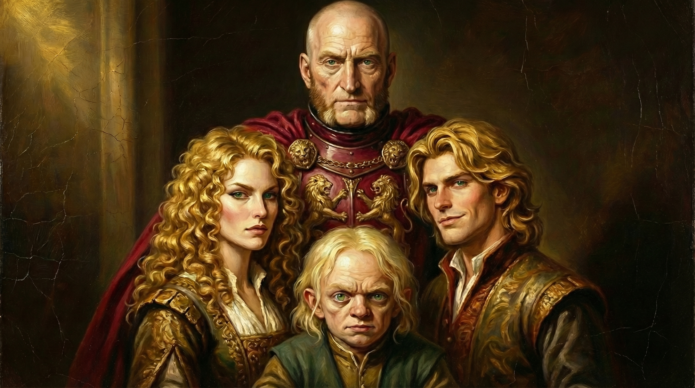

Ser Jaime Lannister là một con sư tử của Casterly Rock, và có lẽ anh cũng chẳng thèm quan tâm người ta nói cái gì về mình. Các người có thể mắng chửi ta, khinh bỉ ta là Kẻ Giết Vua, nhưng các người đâu có biết nếu ta không giết ông ta, thì các ngươi giờ chỉ còn là đống thịt cháy? Ta đã ngửi mùi một người bị thiêu sống trong bộ áo giáp, và ta thề ta không bao giờ muốn ngửi lại mùi đó một lần nào nữa. Ser Jaime, có lẽ đã không ít lần tự nói với mình những lời này. Quá nhiều lời thề, quá nhiều…

<!-- more -->

Catelyn mỉa mai: 
> Ngươi vẫn còn tự nhận mình là một hiệp sĩ được sao, trong khi ngươi đã phá bỏ mọi lời thề của mình?

Jaime lấy chiếc bình và rót đầy cốc rượu:
> Có quá nhiều lời tuyên thệ... họ sẽ bắt bà thề, thề và thề. Bảo vệ nhà vua. Tuân lệnh nhà vua. Giữ bí mật cho ngài. Phụng sự ngài. Hy sinh bản thân vì ngài. Nhưng phải nghe lời cha. Yêu quý chị em gái. Bảo vệ người vô tội. Bảo vệ kẻ yếu. Tôn trọng các vị thần. Tuân thủ luật pháp. Quá nhiều. Dù có làm gì thì bà cũng phải từ bỏ lời thề này để thực hiện lời thề khác.

Jaime vốn là người có cái tôi cao, nếu không muốn nói là kiêu ngạo, bất cần đời, từ trẻ đã thế, và sau khi trở thành "Kẻ Giết Vua", anh còn kiêu ngạo hơn nữa. Với một người đã phá bỏ chính lời thề thiêng liêng của mình, bị tất thảy mọi người khinh bỉ, thì danh dự, có là gì đâu? Anh đâu cần mất công làm hài lòng mọi người, khi chính họ đã khinh bỉ anh, đã cho rằng anh không còn danh dự?

À đúng, danh dự ở đâu khi một hiệp sĩ Vệ Vương lại rút kiếm đâm chết chính vị vua đó? Danh dự ở đâu khi anh ăn nằm với chính chị gái mình, và sinh ra đến ba người con? Danh dự ở đâu với một kẻ mang danh "Kẻ Giết Vua"? 

Jaime chẳng cần thứ danh dự đó, anh đã giết Aerys, nhưng điều đó đã cứu vương quốc này, anh và chị gái mình đã loạn luân, nhưng không phải các vị vua Targaryen cũng như thế sao? Kẻ Giết Vua, Kẻ Giết Vua, sao không ai gọi ta là Kẻ Cứu Vương Quốc, sao không ai gọi ta là Ser Jaime Lannister, Người Chấm Dứt Sự Điên Rồ Của Aerys?

Nói như vậy, cũng không có nghĩa mọi việc anh làm đều đúng đắn. Nó chỉ đúng với bản thân anh mà thôi, mọi điều anh làm là vì bản thân, vì chị gái, vì cha, vì gia tộc Lannister. Anh đã đẩy cậu bé Bran từ cửa sổ xuống vì cậu vô tình chứng kiến anh và Cersei ở cùng nhau. Anh chặn đường Eddard Stark và đòi giết ông vì vợ Eddard là Catelyn đã bắt giữ em trai anh. Anh chẳng từ việc gì, dù nó có vô sỉ tới đâu, miễn bản thân anh và gia tộc anh có lợi, thế là đủ.

**Jaime Lannister: "Ta làm tất cả vì tình yêu"**

Tình yêu của anh, là với Cersei, với Tyrion, với cha anh Tywin, với gia tộc Lannister, với bản thân anh. Anh chẳng quan tâm gì đến những kẻ khác, anh chẳng quan tâm gì đến danh dự, bởi vì, tất cả cũng đâu còn coi anh là một người có chút danh dự nào nữa đâu?

Trong mắt họ, anh không còn là Ser Jaime Lannister của Casterly Rock, mà chỉ còn là một tên Kẻ Giết Vua hèn hạ, khốn nạn. Cũng tốt thôi, thà là như thế, còn thoải mái hơn bảo vệ một kẻ điên loạn sẵn sàng thiêu rụi cả một thành phố.

---

*Tiếp theo, Chapter 3: Jaime Lannister - Con sư tử què cụt*
