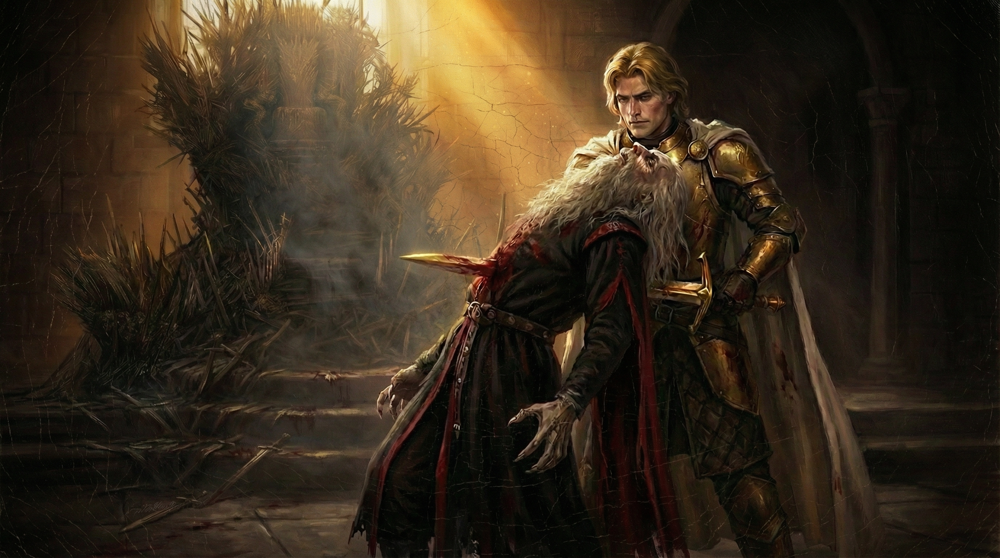

Những lời thề, là những lời lẽ thiêng liêng, được thốt ra dưới sự chứng giám của các vị thần, Thất Diện Thần, Cựu Thần, Thần Chết Chìm,......vị thần nào thì không quan trọng, điều quan trọng là khi một người thốt ra những lời lẽ đó, thì có nghĩa người đó đã chấp nhận để những lời thề ấy trở thành một lời cam kết với các vị thần của mình. Lời thề của một maester, bỏ đi cái họ của mình, Targaryen, Stark, Lannister, Baratheon,... hay thậm chí chỉ là một người xuất thân hèn kém, một khi đã thề lời thề của maester, thì tất cả đều ngang bằng, và tất cả đều là những người phục vụ. Lời thề của Đội Tuần Đêm, không lấy vợ, không sinh con, không sở hữu đất đai, trong màu áo đen, tất cả đều là anh em, tất cả đều là gia đình, thề canh giữ Tường Thành tới lúc chết. Lời thề của một hiệp sĩ, cao quý, thiêng liêng, anh ta thề sẽ bảo vệ kẻ yếu, chiến đấu cho chính nghĩa, sống đúng với cái danh hiệu hiệp sĩ. Và lời thề của một hiệp sĩ trong đội Vệ Vương, còn cao quý hơn. Là một hiệp sĩ mang áo choàng trắng, màu sắc của sự tinh khôi, của sự cao quý, một Vệ Vương thề không lấy vợ, không sinh con, không sở hữu đất đai, và bảo vệ hoàng gia đến khi chết, cũng như Đội Tuần Đêm vậy.

<!-- more -->

Những người anh em trong màu áo đen là gia đình của nhau, thì những người anh em trong bộ giáp trắng cũng thế. Chỉ có điều, người ta khinh rẻ Đội Tuần Đêm, và ngưỡng mộ Vệ Vương mà thôi. 

Nhưng có một điểm chung giữa tất cả những lời thề ấy, đó là kẻ nào phá bỏ lời thề thiêng liêng mà chính miệng mình đã từng thốt ra, thì kẻ đó đến lúc chết vẫn chịu sự khinh bỉ của người đời. Có bao nhiêu kẻ dám phá bỏ lời thề, và có bao nhiêu kẻ có thể chịu đựng được tất cả những sỉ vả, những khinh bỉ sau khi phá bỏ lời thề? Vậy mà trong Game of Thrones, có một kẻ như thế, một người đã thề lời thề của Vệ Vương, và cũng đã phá bỏ lời thề ấy. Một nhân vật có sự phát triển tính cách thú vị bậc nhất trong dàn nhân vật đồ sộ của Game of Thrones. 

Đó là Ser Jaime Lannister, Kẻ Giết Vua, kẻ phá bỏ lời thề.

Jaime Lannister, sinh ra trong gia tộc Lannister hùng mạnh, là con trai cả của lãnh chúa Tywin - Cánh Tay Phải của nhà vua, người quyền lực bậc nhất Bảy Vương Quốc. Khác với người em trai Tyrion của mình - xấu xí, dị dạng, Jaime cùng người chị sinh đôi Cersei lại là niềm tự hào, là ánh sáng của gia tộc sư tử kiêu hãnh, với mái tóc vàng rực rỡ như ánh mặt trời cùng đôi mắt xanh biếc như ngọc lục bảo. Bất cứ ai nhìn vào Jaime, đều sẽ có thể nói anh là người rồi đây sẽ gánh vác gia tộc trong tương lai, sẽ là một Lannister chân chính, một hiệp sĩ dũng mãnh, vĩ đại.

Năm 11 tuổi, Jaime được gửi đến làm cận vệ cho lãnh chúa Crakehall, và chỉ hai năm sau đó, Jaime thắng giải đấu đầu tiên trong đời. Một tương lai xán lạn mở ra trước mắt, với dòng dõi cao quý và khả năng kiếm thuật bẩm sinh, việc Jaime trở thành hiệp sĩ là một điều ai cũng dự đoán được.

Và cái cách Jaime trở thành hiệp sĩ, cũng rất đặc biệt, như chính con người anh vậy. Đó là khi 15 tuổi, anh tham gia đoàn truy lùng nhóm cướp khét tiếng với cái tên Hội Anh Em Rừng Vương. Anh cứu mạng lãnh chúa Crakehall, thậm chí đấu tay đôi với thủ lĩnh nhóm cướp - một gã điên tự xưng là Hiệp Sĩ Mặt Cười. Anh được chính thần tượng của mình, hiệp sĩ vĩ đại nhất Bảy Vương Quốc - Ser Arthur Dayne, Thanh Kiếm Ban Mai phong tước.

Có lẽ đó là một trong những khoảnh khắc tự hào nhất của cậu thiếu niên Jaime Lannister. Được chính người hiệp sĩ mình ngưỡng mộ công nhân thực lực và được chính ông ấy phong tước, với một chàng trai trẻ, như thế là quá đủ, quá đủ vinh quang, quá đủ tự hào. Đến mãi về sau này, Jaime vẫn chẳng thể quên được giây phút đó, và với anh, đó là giây phút đẹp nhất cuộc đời, khi anh quỳ một chân xuống đất, và thanh đại kiếm Ban Mai đặt trên vai, được Ser Arthur Dayne nói những lời lẽ thiêng liêng, và khi đứng dậy, anh là Ser Jaime Lannister, hiệp sĩ trẻ nhất lịch sử Bảy Vương Quốc.

Với bất kỳ một đứa trẻ nào trong Bảy Vương Quốc, hẳn cũng đã một lần từng mơ được trở thành một trong bảy tay kiếm của đội Vệ Vương huyền thoại. Những hiệp sĩ vĩ đại, cao quý trong bộ giáp trắng tinh khôi, thề bảo vệ hoàng gia đến hơi thở cuối cùng. Được trở thành Vệ Vương, có nghĩa là được coi những Aemon Hiệp Sĩ Rồng, Duncan Cao Lớn, Barristan Dũng Cảm, Arthur Dayne Thanh Kiếm Ban Mai là anh em đồng hữu, còn gì có thể sánh với niềm tự hào đó?

Jaime Lannister cũng không ngoại lệ, mặc dù anh biết trở thành Vệ Vương, có nghĩa là anh từ bỏ Casterly Rock, từ bỏ danh hiệu Người Bảo Hộ Phương Tây, nhưng khi 16 tuổi, anh đâu có nghĩ xa đến như thế? Anh cứ mơ ước thôi, anh cứ mơ một ngày mình được khoác áo choàng trắng, mặc giáp trắng, và được mọi người gọi tên Ser Jaime Lannister của Vệ Vương, được ghi tên mình trong Sách Trắng - cuốn sách của riêng các anh em Vệ Vương.

Và một lần nữa, vinh dự đến với anh một cách bất ngờ. Trong giải đấu thương ngựa ở Harrenhal được lãnh chúa Whent tổ chức, anh đã được chính nhà vua chọn vào đội Vệ Vương. Với bất kỳ một hiệp sĩ nào, đây là giây phút vô cùng vinh dự, vô cùng hạnh phúc, và Jaime cũng thế, trong một khoảnh khắc, anh tin rằng vậy là nhà vua đã biết đến tài năng của anh, đã công nhận anh. Bao nhiêu viễn cảnh vụt qua trong đầu Jaime, những chiến công anh sẽ đạt được, những vinh dự anh sẽ nắm lấy, tất cả những mộng tưởng đó, xoay mòng và vút qua đầu óc của một chàng trai 16 tuổi, giữa sự reo hò của dân chúng, và... dưới cái nhìn căm tức của cha anh...

Rút cục, có lẽ Aerys chẳng biết Jaime giỏi đến đâu, hay đúng hơn là chẳng hề quan tâm thằng nhóc này có tiềm năng thế nào. Thứ duy nhất vị vua điên loạn này quan tâm, là cái họ Lannister của anh, là việc phong anh làm Vệ Vương có thể chọc giận lãnh chúa Tywin đến mức nào. Và mọi thứ chỉ là để thỏa mãn sự đố kỵ của Aerys mà thôi. Mọi thứ đều là giả dối với Jaime, vinh quang ư, danh dự ư, tự hào ư? Không hề có những thứ đó, giây phút hạnh phúc khi được chọn làm Vệ Vương, đến cũng nhanh và đi cũng nhanh như thế. Anh chẳng là gì hơn ngoài một quân cờ trong cuộc đấu giữa Cánh Tay Phải và nhà vua, một quân tốt không hơn không kém.

Nhưng một quân tốt, cũng có thể đóng vai trò bất ngờ trong một bàn cờ, quân tốt có thể thăng cấp, có thể trở thành một mối đe dọa khôn lường. Aerys đã chọc tức được Tywin, nhưng từ nay về sau, bên cạnh Aerys sẽ luôn có một Lannister cầm kiếm bất kể ngày đêm. Và dù hắn ta đã mang lời thề của một Vệ Vương, thì biết đâu đấy, chẳng phải trước đây, cũng đã có không ít kẻ phá bỏ lời thề đó ư, ai dám chắc Ser Jaime sẽ không phải là kẻ tiếp theo chứ? Aerys nghĩ thế, nhưng Jaime thì sao? Anh đau đớn, anh giận dữ, anh cảm thấy bất công, nhưng anh vẫn làm tròn lời thề, anh trở về Vương Đô theo lệnh, bỏ dở cuộc đấu thương, nơi mọi hiệp sĩ đều có cơ hội giành lấy vinh quang.

Anh đứng gác hàng đêm cho hoàng gia, anh nghe, và anh thấy hết mọi sự điên loạn của Aerys, khi ông ta hành hạ hoàng hậu Rhaella, khi ông ta thiêu sống lãnh chúa Rickard Stark và xử tử Brandon Stark. Anh ở đó, nghe lời từ biêt cuối cùng của hoàng tử Rhaegar trước trận Trident, anh ở đó khi Vương Đô bị tàn phá, anh ở đó khi Aerys ra lệnh cho anh đi giết chính cha của mình, và anh ở đó, khi cắt cổ Aerys bằng chính thanh kiếm của anh.

Anh đã phá bỏ lời thề của một Vệ Vương, anh đã giết vị vua anh thề sẽ bảo vệ, anh trở thành kẻ phá bỏ lời thề, trở thành Kẻ Giết Vua bị mọi người khinh bỉ. Nhưng có ai ở vị trí của Jaime, mà hiểu được tại sao anh làm thế? Khi cầm kiếm lên giết chết Aerys, có lẽ không hẳn là vì anh muốn ngăn chặn việc ông ta muốn thiêu cháy Vương Đô và giết hại hàng trăm ngàn người, mà có lẽ anh đã chịu đựng sự điên rồi này quá đủ rồi. Phải có một ai đó giết Aerys, trước khi tất cả trở thành đống tro tàn, và nếu phải chọn giữa danh dự và mạng sống của không chỉ người dân, mà còn của chính cha mình, thì có sá gì việc phá vỡ một hay hai lời thề đâu kia chứ?

---

*Tiếp theo, Chapter 2: Jaime Lannister - Ta làm tất cả vì tình yêu*
